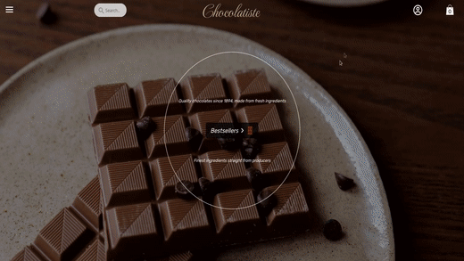

<p align="center">
  
</p>

## Ecommerce Demo Client (React 17, Redux 4)

## ⚠️  Node.js Version Warning

This project was developed with older dependencies (React 17, Redux Toolkit 1.x, Webpack 5.x) which were current around **2021-2022**.

**It is strongly recommended to run this project using Node.js version 16 (LTS).**

While the project may still install with newer versions (v18, v20, etc.), you may encounter various issues, including:

* **Installation/Build Errors:** Conflicts with native modules or deprecations in newer Node.js APIs.
* **Dependency Mismatches:** Unexpected runtime issues or warnings due to older peer dependency requirements.

---

## Quick Start

To build the client for production:
```console
$ npm run build
```

To run the client on development mode:
```console
$ npm run dev
```

## Client Preview



---
